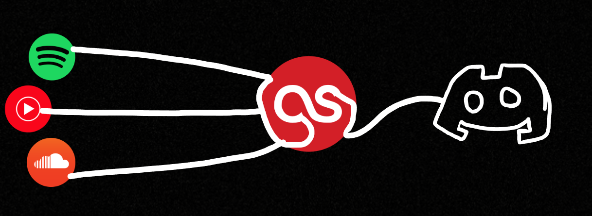
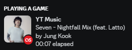
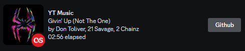

# LastFM-Discord-RPC
<br />
LastFM-Discord-RPC adds a Remote Procedure Call (RPC) to Discord from LastFM.
Adding RPC to Discord will display:<br />
* Currently playing song from LastFM to Discord
* Your LastFM profile picture to Rich Presence (Optional)
* Scrobble amount (how many times you listened to a song) to Rich Presence (Optional)
* The currently playing song's lyrics to your bio (Optional, Beta -  [Please read](#lyrics))


<details>
<summary><a name="lyrics"></a><H2>Add Lyrics to Discord Bio</H2></summary>
To enable Lyrics:
   <ul>
      <li> Go to Discord (https://discord.com/) and select **Login**. </li>
      <li> Enter your Email or phone number and password.</li>
      <li> After logging in, select the Gear Icon (**User Settings**) on the lower-left corner of Discord. </li>
      <li> Got to **User Settings > Profiles > About Me**.</li>
      <li> Right-click in the About Me text-box and select **Inspect** </li>
      <li> A panel opens in your browser:
            *For Microsoft Edge, select Network Icon.
            *For Google Chrome and FireFox, select Network tab. 
      </li>
      <li> Edit your bio and select **Save Changes**.</li>
      <li> A event called "Profile" should now be in the network section, right click it and copy as cCurl (Bash) </li>
      <li> Paste it into https://curlconverter.com/python/ </li>
      <li> Open lyricsBoy.py and paste the output of curlconverter into the cookies and headers section </li>
   </ul>
</details>
   
## Requirements 🛠️
1. Create a [LastFM API Key](https://www.last.fm/api/account/create)
2. Install the packaged version [here](https://github.com/chubbyyb/LastFM-Discord-RPC/releases/tag/v0.2)
3. Run ``lfmRPC.exe``
4. Press settings, input your username and API key
5. Restart the program

# Build 🛠️
I like using electronmon because it hot reloads, feel free to edit manually
1. ```bash
   npm install
   ```
2. ```bash
   npm install electronmon
   ```
3. ```
   npx electronmon .
   ```
   
 
## Images 🎵
<br />
<br />
> Using profile picture as small image<br />
<br />


<details>
<summary>💽 Supported Platforms:</summary>
<ul>
<li>Anything that scrobbles to LastFM is supported</li>
<li>This extension scrobbles most of the major streaming platforms: https://chrome.google.com/webstore/detail/web-scrobbler/hhinaapppaileiechjoiifaancjggfjm</li>
</ul>
</details>
